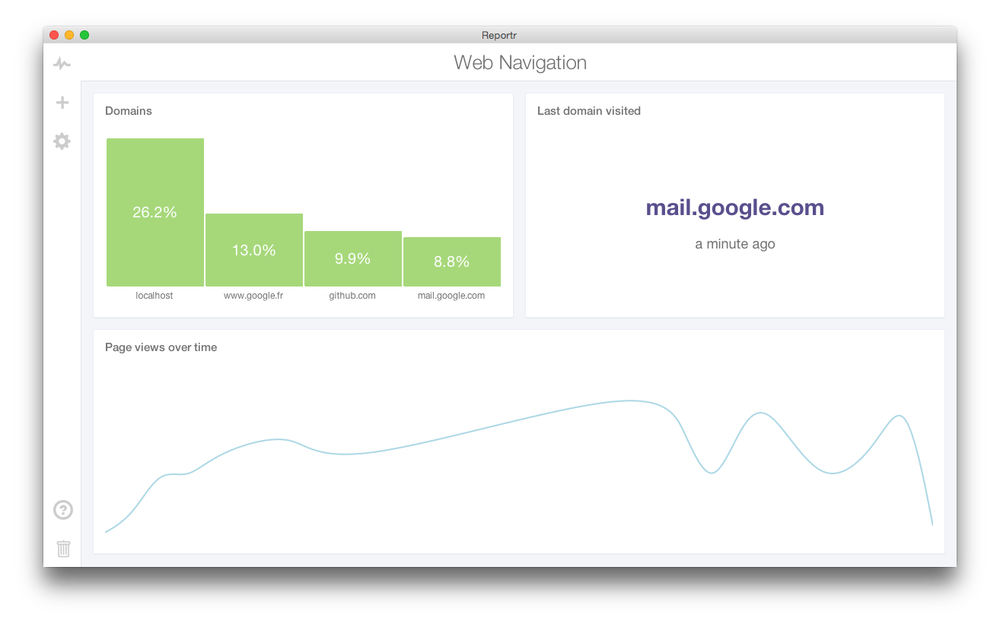

Reportr
=========

> "Your life's personal dashboard."

Reportr is a complete application which works like a dashboard for tracking events in your life (using a very simple API). With a simple interface, it helps you track and display your online activity or your real-life activity (with hardware trackers or applications like Runkeeper), some trackers are available on this organization.

The project is entirely open source and you can host your own Reportr instance on your own server or Heroku.

[](./preview.png)

## Start your instance

Reportr is really easy to run locally or on heroku-compatible services.

```
$ git clone https://github.com/Reportr/dashboard.git
$ npm install .
$ grunt
```

To run it locally (configuration can be stored in a .env file):

```
$ foreman start
```

## API and Events

Reportr uses an HTTP REST API to track events. Datas are always JSON encoded.

| Endpoint | HTTP Method | Description | Arguments |
| -------- | ----------- | ----------- | --------- |
| /api/infos | GET | Get informations about this instance |  |
| /api/events | POST | Post a new event | `<string>type`, `<object>properties` |
| /api/events | GET | List all events | `<string>type`, `<int>start(0)`, `<int>limit` |
| /api/stats/categories | GET | Get categorized events stats | `<string>type`,`<string>field` |
| /api/stats/time | GET | Get time stats | `<string>type`,`<string>fields`, `<string>interval`, `<string>func` |
| /api/reports | POST | Create a new report | `<string>title` |
| /api/reports | GET | List all reports |  |
| /api/report/:id | PUT | Update a report | `<string>title`, `<array>visualizations` |
| /api/report/:id | DELETE | Remove a report |  |

## Configuration

Reportr is configured using environment variables.

| Name | Description |
| ---- | ----------- |
| MONGODB_URL | Url for the mongoDB database |
| AUTH_USERNAME | Username for authentication |
| AUTH_PASSWORD | Password for authentication |

